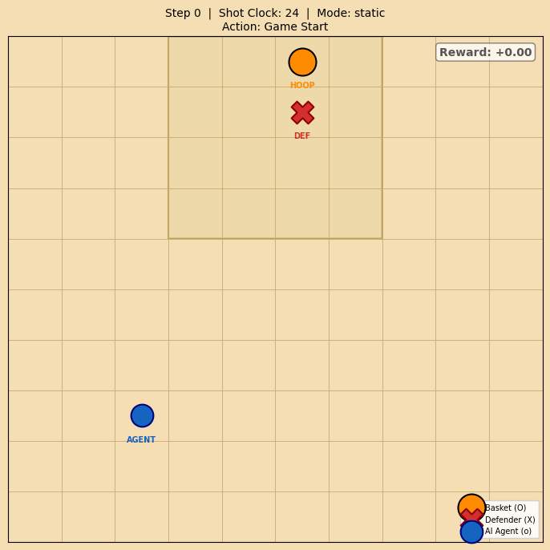
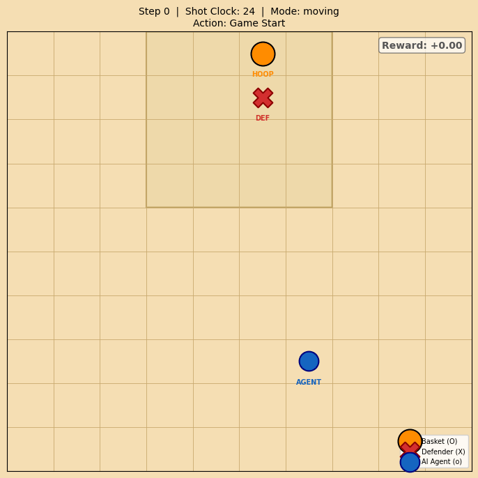
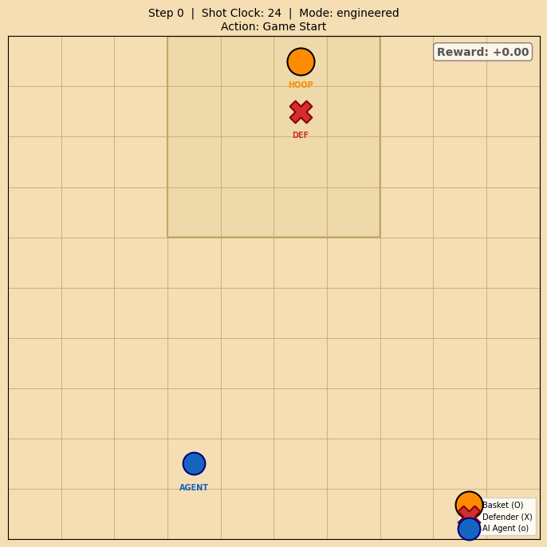

# 🏀 Clutch Shooter RL — Basketball Reinforcement Learning

> A progressive Reinforcement Learning project that teaches an AI agent to play basketball, evolving from a simple Q-Table to a full Deep RL agent with PPO.

---

## What This Is

A four-stage Reinforcement Learning project built entirely from scratch. Each stage introduces one new concept — from the simplest possible tabular agent to a PPO-trained neural network that must navigate around a moving defender to score.

The progression is intentional: every technique is motivated by the failure of the one before it. Stage 1 breaks because the state space is too large. Stage 2 breaks because the defender is static and trivial. Stage 3 breaks because the policy collapses to a single action. Stage 4 fixes it.

---

## Demo

### Stage 2 — Static Defender
> Agent learns to navigate to the basket. Defender never moves. Task: find the shortest path and shoot close.



---

### Stage 3 — Moving Defender
> Defender actively pursues the agent. Task: outmanoeuvre a defender that closes in every other step.



---

### Stage 4 — Reward Engineering
> Same moving defender, but with a redesigned reward signal. Task: discover that driving inside and getting an open shot beats chucking from distance.



---

## The Four Stages

| Stage | Algorithm | Environment | Key Concept Introduced |
|-------|-----------|-------------|------------------------|
| 1 | Q-Table | 1D clutch shot | Bellman equation, ε-greedy |
| 2 | PPO | 2D court, static defender | Gymnasium API, neural policy |
| 3 | PPO | 2D court, moving defender | Policy collapse, local minima |
| 4 | PPO | 2D court, reward engineering | Reward shaping, obs normalisation |

---

## Project Structure

```
clutch_shooter_rl/
├── envs/
│   ├── clutch_shooter_env.py   # Stage 1: bare MDP, no Gymnasium
│   └── basketball_2d_env.py    # Stage 2-4: Gymnasium env, 3 modes
├── agents/
│   └── q_table_agent.py        # Q-Learning: update, decay, save/load
├── training/
│   ├── train_q_table.py        # Stage 1 training loop
│   └── train_ppo.py            # Stage 2-4 PPO (all modes)
├── evaluation/
│   ├── evaluate.py             # Quantitative metrics over N episodes
│   └── visualize.py            # Court animation + GIF export
├── utils/
│   ├── config.py               # All hyperparameters in one place
│   └── logger.py               # Structured logging
├── tests/
│   ├── test_envs.py            # 28 env tests (incl. check_env for all modes)
│   └── test_agents.py          # 5 agent tests (incl. Bellman numerical check)
├── notebooks/
│   └── clutch_shooter_walkthrough.ipynb
├── results/
│   ├── demo_static.gif
│   ├── demo_moving.gif
│   └── demo_engineered.gif
└── models/                     # Saved weights (git-ignored)
```

---
note : you will see results_gif folder in this repo, this was created just to render the gif in the README file

## Quick Start

```bash
git clone https://github.com/aniket-1177/clutch-shooter-rl.git
cd clutch-shooter-rl
pip install -e ".[dev]"
```

### Stage 1 — Train Q-Table

```bash
python training/train_q_table.py
```

Output includes the full learned policy table:

```
=== Learned Q-Table Policy ===
         Clock=0  Clock=1  Clock=2  Clock=3  Clock=4  Clock=5
Dist=5     SHOOT    MOVE     MOVE     MOVE     MOVE     MOVE
Dist=4     SHOOT    SHOOT    MOVE     MOVE     MOVE     MOVE
Dist=3     SHOOT    SHOOT    SHOOT    MOVE     MOVE     MOVE
```

### Stage 2–4 — Train PPO

```bash
# Stage 2: static defender
python training/train_ppo.py --mode static --timesteps 200000

# Stage 3: moving defender
python training/train_ppo.py --mode moving --timesteps 300000

# Stage 4: reward engineering (recommended)
python training/train_ppo.py --mode engineered --timesteps 300000
```

### Evaluate

```bash
python evaluation/evaluate.py \
  --model models/best_engineered/best_model \
  --mode engineered --episodes 200
```

### Visualise + Save GIF

```bash
python evaluation/visualize.py \
  --model models/best_engineered/best_model \
  --mode engineered \
  --save-gif results/my_demo.gif \
  --fps 2
```

### Run Tests

```bash
pytest tests/ -v
# 33 passed
```

---

## Environment Design

### Observation space (6 floats, all normalised to [0, 1])

```
[agent_x, agent_y, defender_x, defender_y, dist_to_basket, shot_clock]
```

All values normalised. Raw coordinates (0–9) mixed with shot clock (0–24) in an unnormalised obs space caused slow, unstable learning — the first layer weights compensate for scale rather than learning the task.

### Action space — Discrete(5)

`0=Up | 1=Down | 2=Left | 3=Right | 4=Shoot`

### Shot probability

```
success_chance = max(0.02, 1.0 - dist_to_basket × 0.18)
# contested (defender within 1.5 cells): × 0.35
```

Distance 1 → 82% open, 29% contested. Distance 6 → 2% open. The steep curve is what makes driving strategically necessary.

### Why no collision penalty?

The first version terminated the episode on collision (agent occupies same cell as defender). This was the root cause of the 1–2 step behaviour: the defender moved at full speed (2 cells/step diagonally), making collision physically unavoidable if the agent moved at all. The rational response was to shoot immediately.

The fix: collision is removed entirely. Defender proximity only affects *shot quality* (contested multiplier). Defender moves at half speed (every other timestep), one axis at a time. Driving is now 11× better in expected value than shooting from the starting position.

---

## Results

Trained for 60k–300k timesteps with PPO (`net_arch=[128,128]`, `ent_coef=0.01`, `device=cpu`).

| Mode | Mean Reward | Mean Steps | Score Rate | Notes |
|------|-------------|------------|------------|-------|
| static | +0.89 | 21.6 | 36% | Learns navigation without threat |
| moving | +0.69 | 14.2 | 30% | Learns to evade but shoots early |
| engineered | +4.78 | 16.4 | 66% | Drives inside, gets open shots |

The jump from +0.69 to +4.78 between `moving` and `engineered` is pure reward engineering — same environment, same PPO algorithm, different incentive structure.

---

## Key RL Concepts Covered

- **MDP** (Markov Decision Process) — state, action, reward, transition
- **Bellman Equation** — tabular value estimation with TD updates  
- **ε-greedy exploration** — with epsilon decay over episodes
- **Gymnasium API** — `reset`, `step`, `observation_space`, `action_space`
- **PPO** (Proximal Policy Optimisation) — actor-critic, clipped objective
- **Observation normalisation** — why raw scales break MLP training
- **Reward engineering** — shaping dense signals to break local minima
- **Local minima diagnosis** — expected-value analysis of stuck policies

<!-- For full theory + step-by-step execution, see **[GUIDE.md](GUIDE.md)**. -->

---

## Configuration

All hyperparameters in `utils/config.py` — no magic numbers scattered across files.

```python
from utils.config import PPOConfig, EnvConfig

config = PPOConfig(learning_rate=3e-4, total_timesteps=300_000)
env_cfg = EnvConfig(progress_reward=0.3, contest_radius=1.5)
```

---

## Future Directions

- [ ] Compare PPO vs DQN on the same environment
- [ ] Curriculum learning: start static, gradually increase defender speed
- [ ] Multi-agent: 2v2, add a teammate the agent must pass to
- [ ] Continuous action space (shot angle + power)
- [ ] Streamlit web demo

---

## License

MIT — see [LICENSE](LICENSE).
